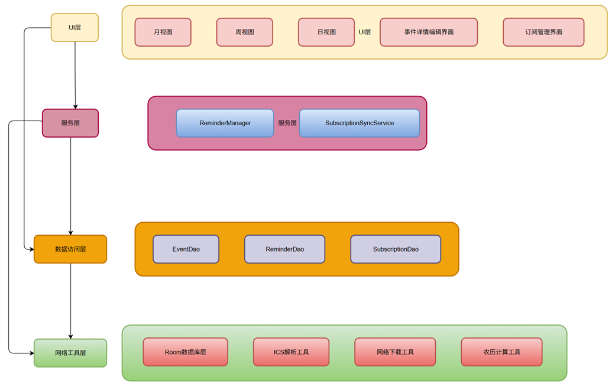

# 日历 App 产品报告

## 一、产品功能介绍

### 1. 基本功能

#### 1) 日历视图展示
- **月视图**：展示当前月份的所有日期，可点击日期查看当日事件
- **周视图**：按周显示事件，方便查看每周安排
- **日视图**：显示单日详细事件，包括开始时间、结束时间、标题和描述

#### 2) 日程管理
- **添加日程**：可输入标题、描述、地点、开始/结束时间、重复规则等
- **编辑日程**：支持修改已存在日程信息
- **查看日程**：点击事件可查看详细信息
- **删除日程**：可删除单个事件或批量删除

#### 3) 日程提醒
- 支持添加多种提醒（如提前 10 分钟、1 小时等）
- Android 12+ 使用 `SCHEDULE_EXACT_ALARM` 权限确保闹钟提醒精确触发
- 提醒以**系统闹钟 + 前台服务**结合实现，保证后台也能触发

---

### 2. 扩展功能

#### 1) 日历事件导入导出
- 支持 **ICS 文件格式**的导入和导出
- 支持批量导入事件，解析 `VEVENT` 内容生成 `Event` 对象
- 导出功能将应用事件生成标准 ICS 文件，方便与其他日历同步

#### 2) 网络订阅功能
- 用户可添加网络日历订阅（如假期日历、节日日历）
- 支持手动同步和定时同步
- 订阅事件自动标识，避免与用户自建事件冲突
- 支持删除订阅及清空订阅事件

#### 3) 农历功能
- 显示农历日期
- 传统节日显示特殊标识

---

## 二、程序概要设计

### 1. 模块划分

| 模块 | 功能描述 |
|----|----|
| UI 层 | 月视图、周视图、日视图、事件添加/编辑界面、订阅管理界面 |
| 数据层 | Room 数据库管理，包含 Event、Reminder、Subscription 三张表 |
| 网络层 | ICS 文件下载与解析，订阅同步服务 |
| 服务层 | 闹钟提醒服务，前台服务保证提醒触发 |
| 工具类 | ICS 文件解析、网络检查、时间格式转换、农历计算 |

---

### 2. 数据结构

#### 1) Event
- id
- title
- description
- location
- startTime
- endTime
- type
- rrule
- isLunar
- lunarDate
- subscriptionId

#### 2) Reminder
- id
- eventId
- minutes

#### 3) Subscription
- id
- name
- url
- updateInterval
- lastUpdateTime
- isEnabled

---

## 三、软件架构图

---

## 四、技术亮点及实现原理

### 1. ICS 文件解析
- 按行读取 ICS 文件，识别 `BEGIN:VEVENT` ~ `END:VEVENT`，提取字段 `SUMMARY`、`DESCRIPTION`、`DTSTART`、`DTEND` 等
- 支持处理 `VALUE=DATE` 类型（全天事件）和 UTC 时间
- 解析结果生成 `Event` 对象，保存到数据库

### 2. 网络订阅同步
- 后台 `SubscriptionSyncService` 通过定时任务或手动触发下载 ICS 文件
- 已订阅事件标记 `type = 3` 和 `subscriptionId`，避免与用户事件冲突
- 支持删除订阅时批量清除对应事件

### 3. 日程提醒机制
- 使用 `AlarmManager` 设置精准闹钟（`SCHEDULE_EXACT_ALARM` 权限）
- 闹钟触发时通过前台服务发送通知，保证 Android 12+ 后台安全

### 4. 农历显示
- 使用算法将公历转换为农历日期
- 在日历视图和事件详情中显示农历信息和节日标识

---

## 五、总结

该日历 App 实现了基本的日历视图、日程管理和提醒功能，并扩展支持 **ICS 导入导出、网络订阅以及农历显示**。整体架构清晰，模块化设计，具有良好的扩展性和可维护性。

**未来可扩展方向：**
1. 多账号同步（如 Google 日历）
2. 高级重复规则支持
3. 主题和 UI 个性化  
